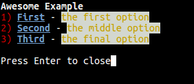

Colorinche
=================================
Colorinche is a Python package to create beautiful CLIs with Blessings from Jinja templates.

How does it works?
==================

First you create a jinja environment and render a template, and print it.

.. code-block:: python

    from colorinche import print_template, set_env

    options = [
        [1, "First", "the first option"],
        [2, "Second", "the middle option"],
        [3, "Third", "the final option"]
    ]

    data = {
        "title": "Awesome Example",
        "options": options,
    }

    set_env("templates_dir")
    print_template(template, data)

Then you create a Jinja template

.. code-block::
    
    {{title}}                                                                 
                                                                                                               
                                                                                    
    {{option.0}})                                                                    
    {{option.1}} - {{option.2}}
                                                                                                               
                                                                                                   

And that's it. You get your pretty Terminal with Blessings charm and your code will be clean.

Installation
============
With pip

.. code-block:: bash

    sudo pip install colorinche

From source

.. code-block:: bash

    git clone https://github.com/felipelerena/colorinche.git
    sudo python setup.py install

Dependencies
=====================
* Jinja2
* Blessings
